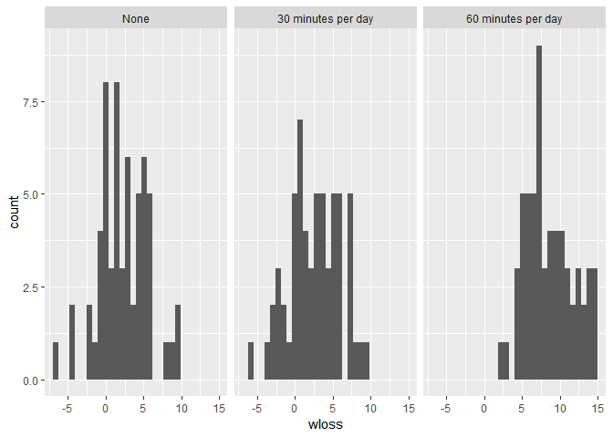
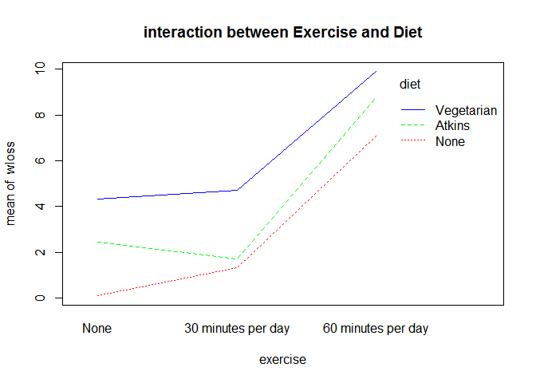

EFFECT OF DIET AND EXCERCISE ON WEIGHT LOSS
================
George
August 13, 2018

PROBLEM
=======

How should someone loose weight effectively?What can we say about diets and exercises?.For an answer 180 participants were assigned to one of 3 diets and one of 3 exercise levels.The participants weight loss afer two months was taken.

In this project i am going to use Two way ANOVA technique to solve the problem.

*Why Am I Using Two Way ANOVA?*

Unlike one way anova where we have one factorial independent variable,Two way ANOVA compares mean of a single dependent continuous variable based two factorial independent variables.In this case i have two independent factorial variables (diet and exercise) and one continuous dependent variablet( weight loss).

The statistic
-------------

*y*<sub>*i**j**k*</sub> = *μ* + *α*<sub>*i*</sub> + *β* + *α**β*<sub>*i**j*</sub> + *ϵ*<sub>*i**j**k*</sub>
 where:

*y*<sub>*i**j**k*</sub>=value of the response variable for the k^th sybject in the i^th level and j^th level.

The hypothesis.
---------------

*H*<sub>*o*</sub><sup>1</sup> : *α*<sub>1</sub> = *α*<sub>2</sub> = ... = *α*<sub>*a*</sub> = 0 =&gt;no main effects of factor A

*H*<sub>*o*</sub><sup>1</sup> : *β*<sub>1</sub> = *β*<sub>2</sub> = ... = *β*<sub>*b*</sub> = 0 =&gt;no main effects of factor B

*H*<sub>*o*</sub><sup>1</sup> : *α**β*<sub>11</sub> = *α**β*<sub>12</sub> = ... = *α**β*<sub>*a**b*</sub> = 0 =&gt;no interraction

DATA IMPORT
===========

``` r
library(foreign)
wghtlss=read.spss("weightloss.sav",to.data.frame = TRUE,use.value.labels = TRUE)
```

    ## re-encoding from UTF-8

``` r
names(wghtlss)
```

    ## [1] "id"       "diet"     "exercise" "wloss"

``` r
head(wghtlss)
```

    ##   id       diet           exercise wloss
    ## 1  1 Vegetarian 60 minutes per day 13.96
    ## 2  2       None 30 minutes per day -2.12
    ## 3  3       None 60 minutes per day  6.92
    ## 4  4     Atkins 30 minutes per day  0.68
    ## 5  5 Vegetarian 60 minutes per day  4.68
    ## 6  6       None 30 minutes per day  0.36

DATA CHEKING
============

``` r
library(dplyr)
```

    ## 
    ## Attaching package: 'dplyr'

    ## The following objects are masked from 'package:stats':
    ## 
    ##     filter, lag

    ## The following objects are masked from 'package:base':
    ## 
    ##     intersect, setdiff, setequal, union

``` r
glimpse(wghtlss)
```

    ## Observations: 180
    ## Variables: 4
    ## $ id       <dbl> 1, 2, 3, 4, 5, 6, 7, 8, 9, 10, 11, 12, 13, 14, 15, 16...
    ## $ diet     <fct> Vegetarian, None, None, Atkins, Vegetarian, None, Non...
    ## $ exercise <fct> 60 minutes per day, 30 minutes per day, 60 minutes pe...
    ## $ wloss    <dbl> 13.96, -2.12, 6.92, 0.68, 4.68, 0.36, 3.72, 8.92, 4.9...

``` r
anyNA(wghtlss)#Checking for any missing value
```

    ## [1] FALSE

``` r
summary(wghtlss)
```

    ##        id                 diet                  exercise      wloss       
    ##  Min.   :  1.00   None      :60   None              :60   Min.   :-6.440  
    ##  1st Qu.: 45.75   Atkins    :60   30 minutes per day:60   1st Qu.: 1.220  
    ##  Median : 90.50   Vegetarian:60   60 minutes per day:60   Median : 4.640  
    ##  Mean   : 90.50                                           Mean   : 4.488  
    ##  3rd Qu.:135.25                                           3rd Qu.: 7.320  
    ##  Max.   :180.00                                           Max.   :14.760

Descriptive Visualizations
==========================

``` r
library(ggplot2)
wghtlss %>% ggplot(mapping = aes(x=wloss))+geom_histogram()+facet_wrap(~exercise)
```

    ## `stat_bin()` using `bins = 30`. Pick better value with `binwidth`.



CONTINGENCY TABLES
------------------

``` r
attach(wghtlss)
table(diet,exercise)
```

    ##             exercise
    ## diet         None 30 minutes per day 60 minutes per day
    ##   None         20                 20                 20
    ##   Atkins       20                 20                 20
    ##   Vegetarian   20                 20                 20

From this output its evident that we are dealing with a balanced design ie equal samples per group.

``` r
wghtlss %>% group_by(diet,exercise) %>% summarise(mean=mean(wloss),Sdev=sd(wloss),Min=min(wloss),Max=max(wloss))
```

    ## # A tibble: 9 x 6
    ## # Groups:   diet [?]
    ##   diet       exercise             mean  Sdev   Min   Max
    ##   <fct>      <fct>               <dbl> <dbl> <dbl> <dbl>
    ## 1 None       None               0.1000  2.75 -6.44  4.12
    ## 2 None       30 minutes per day 1.33    3.02 -3     8.92
    ## 3 None       60 minutes per day 7.09    2.47  2.44 12.9 
    ## 4 Atkins     None               2.46    2.78 -0.76  9.64
    ## 5 Atkins     30 minutes per day 1.71    3.70 -5.96  9.56
    ## 6 Atkins     60 minutes per day 8.76    3.01  4.6  14.8 
    ## 7 Vegetarian None               4.33    2.78 -2.2   9.48
    ## 8 Vegetarian 30 minutes per day 4.72    2.46 -1.16  7.8 
    ## 9 Vegetarian 60 minutes per day 9.89    3.24  4.68 14.4

``` r
fit =aov(wloss~exercise*diet)
summary(fit)
```

    ##                Df Sum Sq Mean Sq F value   Pr(>F)    
    ## exercise        2 1508.9   754.4  87.589  < 2e-16 ***
    ## diet            2  363.9   182.0  21.124 6.33e-09 ***
    ## exercise:diet   4   32.3     8.1   0.937    0.444    
    ## Residuals     171 1472.9     8.6                     
    ## ---
    ## Signif. codes:  0 '***' 0.001 '**' 0.01 '*' 0.05 '.' 0.1 ' ' 1

Above output gives us the two way anova table.The Pr(&gt;F) colums tels us whether the effects and interactions are significant or not.If the effect of exercise was same for all the diets,then we can see we have 0.444 probability of finding our sample results.

### Report

An interaction betweeen diet and exercise could not be demonstrated ,F(4,171)=0.937,p=0.444.

Result visualization
--------------------

``` r
interaction.plot(exercise,diet,wloss,col = rainbow(3),pch = c(16,18,20),main = "interaction between Exercise and Diet")
```


