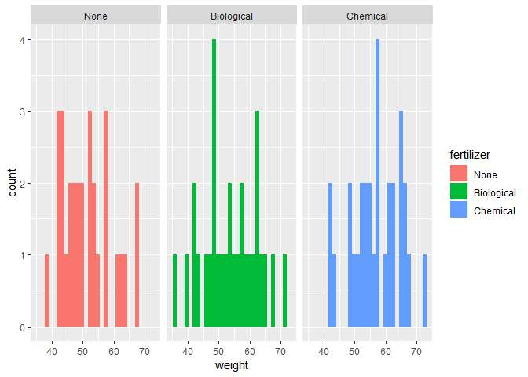
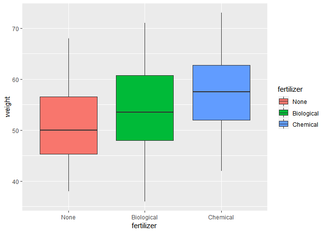
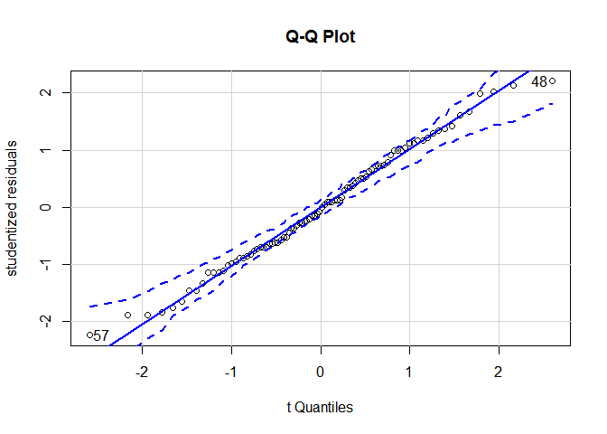
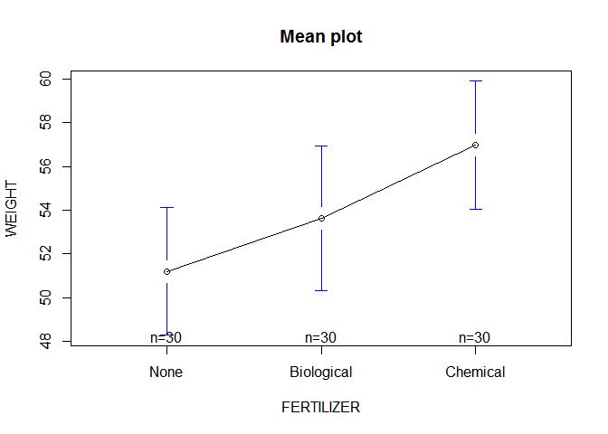
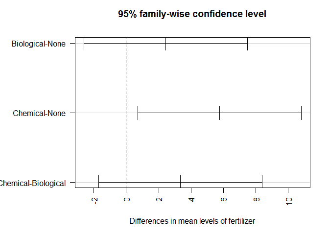

ONE WAY ANOVA TUTORIAL
================

ANOVA-What is It?
=================

ANOVA (Analysis of Variance) is a statistical test used for testing if a significant difference occurs between two or more groups.In case of two groups ,results from ANOVA equals that from independent sample t test because.This is because statistically we know that *F*<sup>2</sup> = *t*.

Hypothesis
==========

The hypothesis test of anova for t population is:

*H*<sub>0</sub>:*μ*<sub>1</sub> = ... = *μ*<sub>*t*</sub>

*H*<sub>*α*</sub>:not all *μ*<sub>*i*</sub>(*i* = 1, ...*t*) are equal.

ONE WAY ANOVA
-------------

In one way ANOVA ,we compare the dependent variable means of two or more groups defined by categorical grouping factor.

Problem statement
-----------------

We want to investigate if the wight if some plants is influenced with using a type of fertilizer.For a sample i have 90 plants randomly divided into 3 groups of 30 plants each.I apply a biological fertilizer to the first group ,a chemical fertilizer to the second group and no fertilizer to the last group.I also have the weights of the plants after a period of 3 months.

### Data Import

``` r
library(foreign)
plants=read.spss("parsley.sav",to.data.frame = TRUE,use.value.labels = TRUE)
```

    ## re-encoding from UTF-8

### Data Checking

It is important to check our data for anomalies and also get a basic i idea of what it looks like.

``` r
anyNA(plants)#cheking missing values
```

    ## [1] FALSE

``` r
names(plants)
```

    ## [1] "fertilizer" "weight"

``` r
library(dplyr)
```

    ## 
    ## Attaching package: 'dplyr'

    ## The following objects are masked from 'package:stats':
    ## 
    ##     filter, lag

    ## The following objects are masked from 'package:base':
    ## 
    ##     intersect, setdiff, setequal, union

``` r
library(ggplot2)
ggplot(plants,mapping = aes(x=weight,y=,fill=fertilizer))+geom_histogram(position = "dodge")+facet_wrap(fertilizer~.)
```

    ## `stat_bin()` using `bins = 30`. Pick better value with `binwidth`.



``` r
ggplot(plants,mapping = aes(x=fertilizer,y=weight,fill=fertilizer))+geom_boxplot(position = "dodge")
```



Above plots steps show no sign of missing data or any serious anomalies.

### Assumptions of the One way ANOVA.

1.  Variables should be IID(independent and identicaly distributed)

The above graph gives a clear picture that this asumption is met.

1.  Homoscedaticity:Dependent variable has the same variance within the population

``` r
bartlett.test(weight~fertilizer,data = plants)
```

    ## 
    ##  Bartlett test of homogeneity of variances
    ## 
    ## data:  weight by fertilizer
    ## Bartlett's K-squared = 0.57467, df = 2, p-value = 0.7503

With a p value &gt;0.05 we can conclude that there was no significant difference in the population variances.

1.  Normality.The dependent Variable is normaly distributed within each population

``` r
library(car)
```

    ## Loading required package: carData

    ## 
    ## Attaching package: 'car'

    ## The following object is masked from 'package:dplyr':
    ## 
    ##     recode

``` r
qqPlot(lm(weight~fertilizer,data=plants),simulate=TRUE,main="Q-Q Plot",labels = TRUE,ylab = "studentized residuals")
```



    ## [1] 48 57

Running ANOVA TEST IN R
-----------------------

``` r
fit <- aov(weight ~ fertilizer,data = plants)
summary(fit)
```

    ##             Df Sum Sq Mean Sq F value Pr(>F)  
    ## fertilizer   2    503  251.43   3.743 0.0276 *
    ## Residuals   87   5845   67.18                 
    ## ---
    ## Signif. codes:  0 '***' 0.001 '**' 0.01 '*' 0.05 '.' 0.1 ' ' 1

``` r
library(gplots)
```

    ## 
    ## Attaching package: 'gplots'

    ## The following object is masked from 'package:stats':
    ## 
    ##     lowess

``` r
plotmeans(weight~fertilizer,xlab="FERTILIZER",ylab="WEIGHT",main="Mean plot",data = plants)
```



I will pay close attention to the summary output above.The DF column show the degree of freedom .The p value (Pr(&gt;F)) is 0.28 ,this means that if population mean weights are exactly equal then i have 2.8% chance of finding the differences that i have observed in my sample.I can therefore safely fail to accept my Null hypothesis.

This means that the weights are significantly affected by the type of fertilizer.

### Reporting

My 3 fert types resulted in different mean weights for parsley plants,F(2,87)=3.7,P=0.028.

### Post Hoc Test(Multiple Comparisons)

Lets say I am dealing with three types of fertilizers and i reach at a conclution that my fertilizers effect are different from each other,how can i know which is different from which?

To do this we use `TukeyHSD()` test that will provide pairwise differences per group.

``` r
TukeyHSD(fit)
```

    ##   Tukey multiple comparisons of means
    ##     95% family-wise confidence level
    ## 
    ## Fit: aov(formula = weight ~ fertilizer, data = plants)
    ## 
    ## $fertilizer
    ##                         diff        lwr       upr     p adj
    ## Biological-None     2.433333 -2.6129392  7.479606 0.4863309
    ## Chemical-None       5.766667  0.7203941 10.812939 0.0210196
    ## Chemical-Biological 3.333333 -1.7129392  8.379606 0.2618374

``` r
par(las=2)
par(mar=c(5,8,4,2))
plot(TukeyHSD(fit))
```


