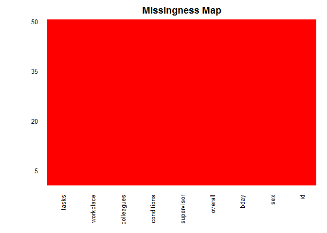
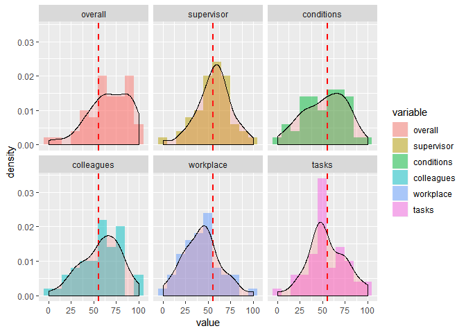
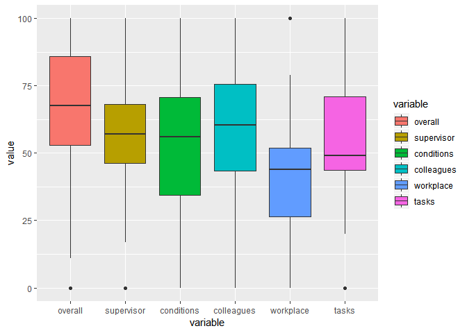
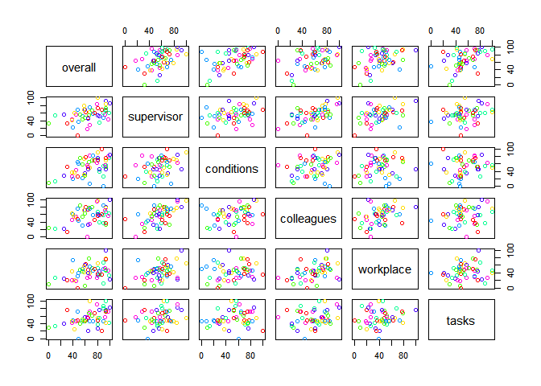
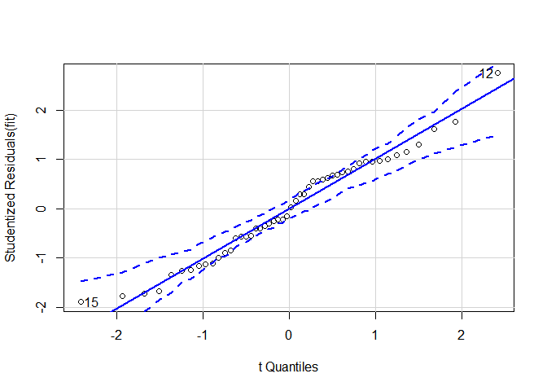
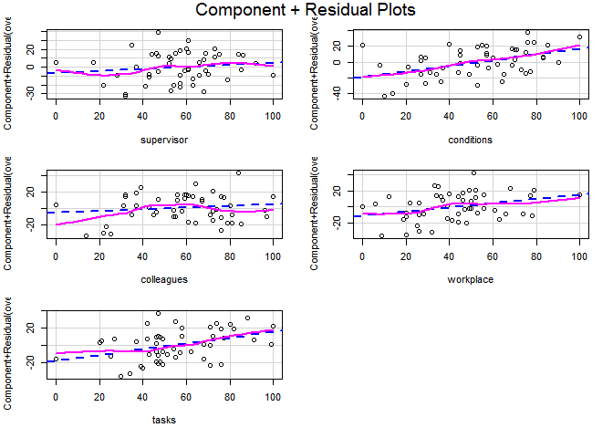
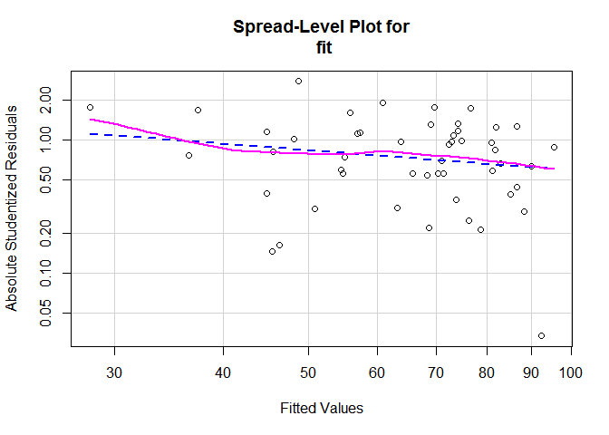
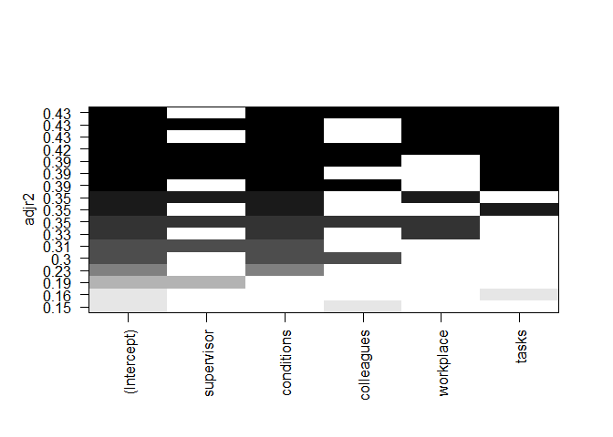
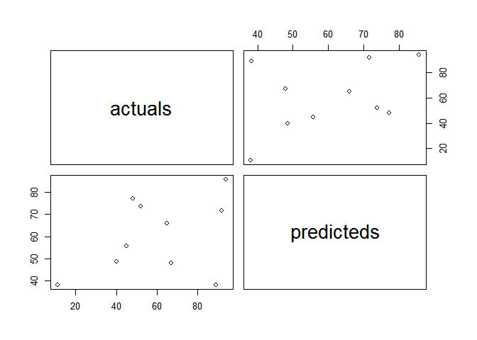

MULTIPLE LINEAR REGRESSION
================
George
August 9, 2018

Intro
=====

Multiple linear regression is used to predict a quantitative dependent variable from a number of explanatory variables.

The set of independent variables are believed to have a linear relation ship with the dependent variable. The equation looks something like:
*y* = *β*<sub>0</sub> + *β*<sub>1</sub>*x*<sub>1</sub> + *β*<sub>2</sub>*x*<sub>2</sub> + *β*<sub>3</sub>*x*<sub>3</sub> + ... + *β*<sub>*n*</sub>*x*<sub>*n*</sub> + *ϵ*<sub>*i**j*</sub>

where the betas are the coefficients.

Case:Employee satisfaction Study
--------------------------------

A company held an employee satisfaction survey which included overall employee satisfaction. Employees also rated some main job quality aspects and slowed to rate in a scale of 0 to 100 representing total disagreement and total agreement respectively.This data was stored in a file called **work.sav**.

The main question in this problem is:

**Which quality aspects predict job satisfaction and to which extent?**

First I will need to import the data and necessary libraries into my R working session. 1. Libraries

``` r
library(foreign)#for inporting .sav files
library(dplyr)#for data manipulation
```

    ## 
    ## Attaching package: 'dplyr'

    ## The following objects are masked from 'package:stats':
    ## 
    ##     filter, lag

    ## The following objects are masked from 'package:base':
    ## 
    ##     intersect, setdiff, setequal, union

``` r
library(ggplot2)#for data visualization
library(tidyverse)#for data manipulation
```

    ## -- Attaching packages ------------------------------------------------ tidyverse 1.2.1 --

    ## v tibble  1.4.2     v purrr   0.2.5
    ## v tidyr   0.8.1     v stringr 1.3.1
    ## v readr   1.1.1     v forcats 0.3.0

    ## -- Conflicts --------------------------------------------------- tidyverse_conflicts() --
    ## x dplyr::filter() masks stats::filter()
    ## x dplyr::lag()    masks stats::lag()

``` r
library(broom)#for data manipulation
library(car)#for regression analysis
```

    ## Loading required package: carData

    ## 
    ## Attaching package: 'car'

    ## The following object is masked from 'package:purrr':
    ## 
    ##     some

    ## The following object is masked from 'package:dplyr':
    ## 
    ##     recode

``` r
library(reshape2)#data manipulation
```

    ## 
    ## Attaching package: 'reshape2'

    ## The following object is masked from 'package:tidyr':
    ## 
    ##     smiths

``` r
library(leaps)#analysing correlations
library(corrplot)#analysing correlations
```

    ## corrplot 0.84 loaded

``` r
library(Amelia)#missing data check
```

    ## Loading required package: Rcpp

    ## ## 
    ## ## Amelia II: Multiple Imputation
    ## ## (Version 1.7.5, built: 2018-05-07)
    ## ## Copyright (C) 2005-2018 James Honaker, Gary King and Matthew Blackwell
    ## ## Refer to http://gking.harvard.edu/amelia/ for more information
    ## ##

``` r
library(mlbench)#
```

1.  The Data

``` r
work=read.spss("C:/Users/Ruralnet20/Downloads/work.sav",to.data.frame = TRUE,use.value.labels = FALSE)
```

    ## re-encoding from UTF-8

1.  Basic Data Exploration

Before I jump in i will take some time to peep into my data set and get to know its structure and make up and check for missing data just incase.

``` r
glimpse(work)
```

    ## Observations: 50
    ## Variables: 9
    ## $ id         <dbl> 1, 2, 3, 4, 5, 6, 7, 8, 9, 10, 11, 12, 13, 14, 15, ...
    ## $ sex        <dbl> 1, 0, 1, 0, 1, 0, 1, 1, 0, 0, 1, 0, 0, 1, 1, 0, 0, ...
    ## $ bday       <dbl> 13153183107, 13167393269, 13151532386, 13155697184,...
    ## $ overall    <dbl> 65, 58, 0, 80, 56, 93, 45, 61, 68, 71, 99, 89, 26, ...
    ## $ supervisor <dbl> 47, 79, 32, 53, 52, 92, 57, 63, 63, 66, 61, 47, 57,...
    ## $ conditions <dbl> 53, 73, 10, 71, 21, 45, 44, 77, 49, 69, 76, 0, 29, ...
    ## $ colleagues <dbl> 74, 72, 25, 67, 31, 80, 55, 81, 76, 81, 64, 84, 23,...
    ## $ workplace  <dbl> 49, 41, 9, 52, 50, 100, 19, 63, 39, 53, 33, 51, 25,...
    ## $ tasks      <dbl> 54, 46, 30, 37, 46, 77, 47, 49, 99, 62, 42, 47, 39,...

``` r
work2=work %>% mutate(sex=factor(sex,levels = c(1,0),labels = c("Male","Female"))) #for recording sex variable
work2 %>% select(sex) %>% str
```

    ## 'data.frame':    50 obs. of  1 variable:
    ##  $ sex: Factor w/ 2 levels "Male","Female": 1 2 1 2 1 2 1 1 2 2 ...

``` r
missmap(work2,col = c("green","red"),legend = FALSE)
```



``` r
anyNA(work)
```

    ## [1] FALSE

Cool!No missing data!

From the output above its evident that i am working with a datset containing 50 observations and 9 variables.For small modification i will transform sex variable to factor as shown above.

### INSPECT HISTOGRAMS

Before starting anything with my data,i will inspect my histograms to see if my variables make some sense.

``` r
work2long=melt(work2[,-3],id.vars = c("id","sex"))
head(work2long)
```

    ##   id    sex variable value
    ## 1  1   Male  overall    65
    ## 2  2 Female  overall    58
    ## 3  3   Male  overall     0
    ## 4  4 Female  overall    80
    ## 5  5   Male  overall    56
    ## 6  6 Female  overall    93

``` r
par(mfrow=c(3,4))
```

OR with ggplot

``` r
work2long %>% ggplot(mapping = aes(x=value,y=,fill=variable))+geom_histogram(aes(y=..density..),binwidth = 10 ,alpha=.5, position="identity")+facet_wrap(variable~.)+geom_vline(aes(xintercept=mean(value)),linetype="dashed",size=1,colour="red")+geom_density(alpha=.2, fill="#FF6666")
```



My plots above shows me that there is no missing data available ,no serious outliersand all my frequencies are plausible.

Inspecting Descriptives
-----------------------

Despite having graphs to help us to visualize data,i.e getting a clear picture of the distribution and shape of our data,tables are also a good tool that can help us do the same.

``` r
work2long %>%group_by(variable) %>% summarise(mean=mean(value),n=length(value),max=max(value),min=min(value),sd=sd(value))
```

    ## # A tibble: 6 x 6
    ##   variable    mean     n   max   min    sd
    ##   <fct>      <dbl> <int> <dbl> <dbl> <dbl>
    ## 1 overall     66.7    50   100     0  23.2
    ## 2 supervisor  56.4    50   100     0  19.2
    ## 3 conditions  52.7    50   100     0  23.6
    ## 4 colleagues  58.3    50   100     0  22.2
    ## 5 workplace   42.6    50   100     0  20.5
    ## 6 tasks       54.6    50   100     0  20.8

``` r
work2long %>% ggplot(mapping = aes(x=variable,y=value,fill=variable))+geom_boxplot()
```



### Inspecting scatter Pots(Bivariate correlation)

At this point i am going to to use a scatter plot to inspect if my predictors have a nearly linear relation with my dependent variable.

Its more important to inspect linearity for each predictor separately.This is because residual plots give us a correlation of weighted predictor variables vs residuals.In case one explanatory variable has a covelinear relation will then it will not be shown.This is why I have chosen to bi-variate correlation two at a time

The bi-variate correlations are provided by the cor() and plot

``` r
vars=work2 %>% select(everything(),-c(id,sex,bday)) %>% cor
round(vars,3)
```

    ##            overall supervisor conditions colleagues workplace tasks
    ## overall      1.000      0.453      0.497      0.404     0.400 0.420
    ## supervisor   0.453      1.000      0.345      0.600     0.428 0.246
    ## conditions   0.497      0.345      1.000      0.263     0.139 0.126
    ## colleagues   0.404      0.600      0.263      1.000     0.406 0.196
    ## workplace    0.400      0.428      0.139      0.406     1.000 0.142
    ## tasks        0.420      0.246      0.126      0.196     0.142 1.000

``` r
#plot(work2[,4:9])
#or
pairs(work2[,4:9],col=rainbow(7))
```



My correlations show that all explanatory variables correlate *statistically significantly* with the dependent variable.Unfortunately there is also some substantial correlations among predictors themselves,i.e they overlap.

### Regression Model

### Fitting My Model

``` r
names(work2)
```

    ## [1] "id"         "sex"        "bday"       "overall"    "supervisor"
    ## [6] "conditions" "colleagues" "workplace"  "tasks"

``` r
fit=lm(overall~supervisor+conditions+colleagues+workplace+tasks,data = work2)
summary(fit)
```

    ## 
    ## Call:
    ## lm(formula = overall ~ supervisor + conditions + colleagues + 
    ##     workplace + tasks, data = work2)
    ## 
    ## Residuals:
    ##     Min      1Q  Median      3Q     Max 
    ## -29.781 -12.955  -0.955  12.010  40.274 
    ## 
    ## Coefficients:
    ##             Estimate Std. Error t value Pr(>|t|)   
    ## (Intercept)   5.8542    10.1200   0.578  0.56589   
    ## supervisor    0.1169     0.1761   0.664  0.51029   
    ## conditions    0.3632     0.1141   3.182  0.00268 **
    ## colleagues    0.1028     0.1454   0.707  0.48343   
    ## workplace     0.2558     0.1394   1.836  0.07317 . 
    ## tasks         0.3340     0.1255   2.660  0.01085 * 
    ## ---
    ## Signif. codes:  0 '***' 0.001 '**' 0.01 '*' 0.05 '.' 0.1 ' ' 1
    ## 
    ## Residual standard error: 17.63 on 44 degrees of freedom
    ## Multiple R-squared:  0.4827, Adjusted R-squared:  0.4239 
    ## F-statistic:  8.21 on 5 and 44 DF,  p-value: 1.529e-05

Woa!Allot of chunk here but lets break it into pieces. Multiple linear regression coefficients indicate an increase in in dependent variable for a unit change in a predictor variable ,holding other predictor variables constant

In the above output the regression coefficient for workplace is 0.2558 suggesting an increase of 1 percent in overal satisfaction is is associated with a 0.2558 percent increase in workplace,controlling for the remaining variables.This coefficient is significantly different from zero at p&lt;0.1 level.

Taken together the predictor variables account for 48% (**Multiple R squared**) of the variance in work place satisfaction among workers . a). t-value

T-value can be interprated as.A larger t-value indicates that it is less likely that the coefficient is not equal to zero purely by chance .So the larger the t value the better.

Pr(&gt;|t|) or in most cases the p-value is the probability of getting a larger t value as high or higher than the observed value when the null hypothesis is true.In this case if the p-value is low then the coefficients are significantly different from zero that is they are said to be significant.

b.) R-squared

R squared value tells us the propotion of variationin the dependent (response) variable that has been explain by our model.
$$R^2=1-\\frac{SSE}{SST}$$
 for our model is its 48%. C.)Adjusted R-squared

R Squared value increases with the increase of more explanatory variables in the model.Adjusted R squared penalizes total value for the number of terms in a model.
$$R\_{adj}^2=1-\\frac{MSE}{MST}$$
 d.) Standard Error and the F-Statistic

These two values measures the godness of fit. $se=\\sqrt{\\frac{SSE}{n-q}}$ is the average error in predicting overal job satisfaction from the other predictor variables using the model. $F=\\frac{MSR}{MSE}$ tests whether the predictor variables taken together ,predict the response variable above chance levels.In cases of one predictor variable the f test is equal to t-test.

Regression Diagnostics
----------------------

**How good is my model?** Up to this point there is nothing that tels me if my model is good or not.My confidence in reporting regression parameters depends on how well they met regression assumptions.

A regression model should meet the following assumptions.

1.  **Normality**

Dependent variable should be normaly distributed for a fixed set of explanatory variables.

``` r
qqPlot(fit,labels = col.names(work2[,4:9],id.method="identity",simulate=TRUE,main="Q-Q Plot"))
```



    ## [1] 12 15

``` r
work2[c(12,15),]
```

    ##    id    sex        bday overall supervisor conditions colleagues
    ## 12 12 Female 13152579481      89         47          0         84
    ## 15 15   Male 13151675162      31         32         53         14
    ##    workplace tasks
    ## 12        51    47
    ## 15        20    76

``` r
fitted(fit)[c("12","15")]
```

    ##       12       15 
    ## 48.72620 60.78074

``` r
rstudent(fit)[c("12","15")]
```

    ##        12        15 
    ##  2.748877 -1.889801

``` r
#
```

1.  **Independence**

Explanatory variables should be independent of the predictor variables.The best way to assess this assumption ones knowledge on how the data were collected.

I am going to use durbin watson test to test for detetion of serialy auto correlated errors.

``` r
durbinWatsonTest(fit)
```

    ##  lag Autocorrelation D-W Statistic p-value
    ##    1       0.2340711      1.515222   0.124
    ##  Alternative hypothesis: rho != 0

The reuslts above shows us that the is no autocorrelation among my explanatory variables(p=0.088).The lag value of 1 indicates that each observation is compared with the next one.

1.  **Linearity**

The dependent variable should be linearly related to independent variables.

I am giong to look for any systematic depature from the linear model above.

``` r
crPlots(fit)
```



Good!Wee can see that most of our data points linear. 4. **Homoscedasticity**

The variance of the dependent variable doesn’t vary with the levels of the independent variables.

I am going to use the ncvTest() function in the `car` package

``` r
ncvTest(fit)
```

    ## Non-constant Variance Score Test 
    ## Variance formula: ~ fitted.values 
    ## Chisquare = 2.090374, Df = 1, p = 0.14823

``` r
spreadLevelPlot(fit)
```



    ## 
    ## Suggested power transformation:  1.500615

Another assumption met!Feels good.The test score is not significant (p=0.15).The points from a random horizontal line around the line of best fit.

#### Model selection.

**Which predictor variables substancialy contribute to predicting job satisfaction?**

My correlations showed that all explanatory variables correlate *statistically significantly* with the dependent variable.Unfortunately there is also some substantial correlations among predictors themselves,i.e they overlap.

Back to the above question.How do I get the "Best" model.I am going to do this using some the following ways.

1.  Comparing models.

-   anova()
-   AIC()

1.  Variable selection.

-   Stepwise Regression.
-   All Subsets Regression.

#### Comparing models

This can be done by the anova() function.It is is used in comparison of two models.In my previous model the variable conditions was not significant so i will compare a model where there is no condition and andthe full model.

``` r
fit2=lm(formula = overall ~ supervisor + colleagues + workplace + tasks,data = work2)
anova(fit2,fit)
```

    ## Analysis of Variance Table
    ## 
    ## Model 1: overall ~ supervisor + colleagues + workplace + tasks
    ## Model 2: overall ~ supervisor + conditions + colleagues + workplace + 
    ##     tasks
    ##   Res.Df   RSS Df Sum of Sq      F   Pr(>F)   
    ## 1     45 16826                                
    ## 2     44 13678  1    3147.8 10.126 0.002682 **
    ## ---
    ## Signif. codes:  0 '***' 0.001 '**' 0.01 '*' 0.05 '.' 0.1 ' ' 1

Looking at the above output,we can see that the test is significant at p=0.003 showinhg that work conditions add to the linear prediction and hence we are not supposed to drop it.

**Akaike Information Criterion(AIC)** provides a quicker method for comparing models.Models with a smaller AIC nsicaring adequate fit with fewer parameters are prefered.

``` r
AIC(fit,fit2)
```

    ##      df      AIC
    ## fit   7 436.4690
    ## fit2  6 444.8254

My output is sugesting that a model with all the predictor variables still is better.

#### Variable Selection.

The above model comparison is agood method but not the best.It is not effective when youhave somany variables in your model.

*STEPWISE REGRESSION*

Stepwise regression compares variables in a model by adding/deleting models one at a time.This is done when adition addition/deletion doesnt add improvement to the model.

``` r
library(MASS)
```

    ## 
    ## Attaching package: 'MASS'

    ## The following object is masked from 'package:dplyr':
    ## 
    ##     select

``` r
stepAIC(fit,direction = "backward")
```

    ## Start:  AIC=292.58
    ## overall ~ supervisor + conditions + colleagues + workplace + 
    ##     tasks
    ## 
    ##              Df Sum of Sq   RSS    AIC
    ## - supervisor  1    136.97 13815 291.07
    ## - colleagues  1    155.29 13833 291.14
    ## <none>                    13678 292.57
    ## - workplace   1   1047.53 14725 294.26
    ## - tasks       1   2199.97 15878 298.03
    ## - conditions  1   3147.78 16826 300.93
    ## 
    ## Step:  AIC=291.07
    ## overall ~ conditions + colleagues + workplace + tasks
    ## 
    ##              Df Sum of Sq   RSS    AIC
    ## - colleagues  1     412.6 14227 290.55
    ## <none>                    13815 291.07
    ## - workplace   1    1319.6 15134 293.63
    ## - tasks       1    2399.2 16214 297.08
    ## - conditions  1    3658.3 17473 300.82
    ## 
    ## Step:  AIC=290.54
    ## overall ~ conditions + workplace + tasks
    ## 
    ##              Df Sum of Sq   RSS    AIC
    ## <none>                    14227 290.55
    ## - workplace   1    2241.8 16469 295.86
    ## - tasks       1    2717.0 16944 297.28
    ## - conditions  1    4414.0 18641 302.06

    ## 
    ## Call:
    ## lm(formula = overall ~ conditions + workplace + tasks, data = work2)
    ## 
    ## Coefficients:
    ## (Intercept)   conditions    workplace        tasks  
    ##     10.9586       0.4084       0.3366       0.3644

The stepAIC above suggests that the model with conditions ,workplace and tasks is better since it has the lowest AIC value.

**ALL SUBJECTS REGRESSION**

The above methods does not compare every combination of the regression model.This is easly done with the all subsets regression method.

I will perform all subsets regression by using regsubsets() function from the leaps package.

``` r
leaps=regsubsets(overall ~ supervisor + conditions + colleagues + workplace + tasks, data = work2,nbest = 4)
plot(leaps,scale = "adjr2")
```



The figure above shows all posible combinations of predictor models.We can see that a model consisting of only one predictor variable has an adjusted r squared value of 0.16 and that of all variables except tasks has an adjusted r squared of 0.35.The r-squared value start stabilizing at 0.43 as we include 4 best predictors.

My graph suggests that the model without supervisor or colleagues or both is the "best"(of course no model is best!) for explaining employee job satisfaction.Simple!

### Model Prediction

**How will my model perform in real life data??**

We did a good job fitting my model,checked diagnostics and came up with the model i think is best but i dont know how my model will perform in real life.

I will split my data into a 80:20 ratio sample ,ie (training:test) use my best combination of predictor variables from above to build a model then use this model to predict the dependent variable on test data.

1.  Creating the training and the test data samples from original.

``` r
set.seed(50)
worktrainindex=sample(1:nrow(work2),0.8*nrow(work2))#row indices for work training data
worktrainingData = work2[worktrainindex,4:9]
worktestData = work2[-worktrainindex,4:9]
```

1.  Modelling on training data

``` r
trainmod=lm(overall ~ supervisor + conditions + colleagues + 
    workplace + tasks, data = worktrainingData)#training model
```

I am going to predict the distance on test data

``` r
distance = predict(trainmod,worktestData) #predicting the distance
```

1.  Reviewing Diagnostic Measures

``` r
summary(trainmod)
```

    ## 
    ## Call:
    ## lm(formula = overall ~ supervisor + conditions + colleagues + 
    ##     workplace + tasks, data = worktrainingData)
    ## 
    ## Residuals:
    ##     Min      1Q  Median      3Q     Max 
    ## -34.546 -10.343   0.625  12.875  27.364 
    ## 
    ## Coefficients:
    ##             Estimate Std. Error t value Pr(>|t|)    
    ## (Intercept)  6.40643   10.13485   0.632  0.53154    
    ## supervisor   0.17856    0.19168   0.932  0.35814    
    ## conditions   0.48750    0.12739   3.827  0.00053 ***
    ## colleagues  -0.01401    0.15595  -0.090  0.92897    
    ## workplace    0.19094    0.14153   1.349  0.18622    
    ## tasks        0.31534    0.12295   2.565  0.01491 *  
    ## ---
    ## Signif. codes:  0 '***' 0.001 '**' 0.01 '*' 0.05 '.' 0.1 ' ' 1
    ## 
    ## Residual standard error: 15.97 on 34 degrees of freedom
    ## Multiple R-squared:  0.5576, Adjusted R-squared:  0.4926 
    ## F-statistic: 8.571 on 5 and 34 DF,  p-value: 2.48e-05

Looking at the model sumary results i can see that all my p values for my predictors coeficients are significant.It gives me some confidence that my model is statistically significant.

1.  Calculating prediction Accuracy and Error rates.

To calculate accuracy measurement,I will use a simple correlation between the actuals and the predicted values.The higher the correlation accuracy the better the values are predicted by the model.Also using k-fold cluster validation can be applied.

All the codes below can help you arrive at the same conclution

``` r
actuals=worktestData$overall
predicteds=distance
correlations=cor(data.frame(actuals,predicteds))
correlations
```

    ##              actuals predicteds
    ## actuals    1.0000000  0.3989488
    ## predicteds 0.3989488  1.0000000

``` r
#corrplot(correlations,method = "circle")
pairs(data.frame(actuals,predicteds))
```



``` r
#scatterplotMatrix(data.frame(actuals,predicteds))
```

**A bit of K-Fold cross validation.**

Here sample is divided into k mutualy exclusive sub-samples.The k is used as the test group while the remaining k-1 sub-samples are treated as the training group.The performance from the k prediction equations is averaged and used to compare linear models.

``` r
#library(DAAG)
#shrinkage=suppressWarnings(CVlm(df=work2[,4:9],form.lm=supervisor + conditions + colleagues + workplace + tasks,m=5,dots=FALSE,seed=29,legend.pos="topleft",printit = FALSE,nain="K FOLD CROSS VALIDATION"))
#attr(shrinkage,'ms')
```

Thanks for reading along!
