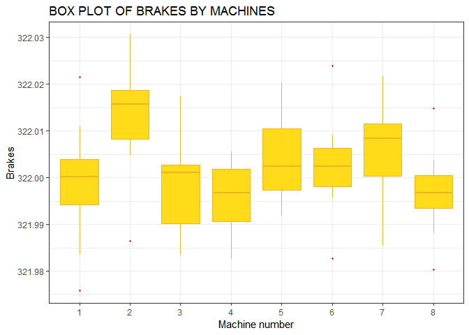

T-TESTs IN R
================
George
August 5, 2018

ONE SAMPLE T TEST
=================

One sample t test is a statistical test used to compare a sample mean with a hypothesised or theoritical mean.

``` r
library(dplyr)
```

    ## 
    ## Attaching package: 'dplyr'

    ## The following objects are masked from 'package:stats':
    ## 
    ##     filter, lag

    ## The following objects are masked from 'package:base':
    ## 
    ##     intersect, setdiff, setequal, union

``` r
library(tidyverse)
```

    ## -- Attaching packages ------------------------------------------------ tidyverse 1.2.1 --

    ## v ggplot2 3.0.0     v readr   1.1.1
    ## v tibble  1.4.2     v purrr   0.2.5
    ## v tidyr   0.8.1     v stringr 1.3.1
    ## v ggplot2 3.0.0     v forcats 0.3.0

    ## -- Conflicts --------------------------------------------------- tidyverse_conflicts() --
    ## x dplyr::filter() masks stats::filter()
    ## x dplyr::lag()    masks stats::lag()

``` r
library(broom)
library(ggplot2)
```

The hypothesis
--------------

$H\_O:\\mu=\\bar x$ Sample mean is equal to the hypothesised mean.
$H\_O:\\mu \\ne \\bar x$ Sample mean is not equal hypothesised mean.

where *μ* is the sample mean and $\\bar x$ is our hypothesised mean.

The statistic.
--------------

$$t=\\frac{(\\mu-\\bar x)}{\\frac{s^2}{n}} $$
 \#\#Performing in R

To peform this test in R we will need this syntax,

``` r
#t.test(x,mu=0,alternative="two.sided")
```

### Sample project.

A manufacturer of high-performance automobiles produces disc brakes that must measure 322 millimeters in diameter. Quality control randomly draws 16 discs made by each of eight production machines and measures their diameters.

In this example our hypothetical mean is 322mm.

### Hypothesis

**Null hypothesis**:*Population mean equals to 322mm*
**Alternative Hypothesis**:*Population mean is significantly different from 322mm*

The test.
---------

I am going to import our data first into R session.To do this i will first load the `foreign()` package which will alow me to import SPSS data file.

``` r
library(foreign)
mydata=read.spss("C:/Users/Ruralnet20/Documents/brakes.sav",to.data.frame = TRUE,use.value.labels = TRUE)
```

    ## re-encoding from UTF-8

``` r
glimpse(mydata)
```

    ## Observations: 128
    ## Variables: 2
    ## $ machine <dbl> 1, 1, 1, 1, 1, 1, 1, 1, 1, 1, 1, 1, 1, 1, 1, 1, 2, 2, ...
    ## $ brake   <dbl> 322.0003, 322.0048, 322.0215, 321.9907, 322.0109, 321....

Before the test i will take a view into my data and see its dimensions, variable names and some of its properties using the glimpse() command in dplyr package.I will also need to transform the first variable into factor in order to perform my one sample t-test per group using the mutate comand.

``` r
head(mutate(mydata,machines=as.factor(machine)))
```

    ##   machine    brake machines
    ## 1       1 322.0003        1
    ## 2       1 322.0048        1
    ## 3       1 322.0215        1
    ## 4       1 321.9907        1
    ## 5       1 322.0109        1
    ## 6       1 321.9954        1

``` r
mydata1=mydata %>% mutate(machines=as.factor(machine))%>% #to transform the data
  select(machines,brake) #to select only the required variables for analysis
```

### Visualization.

Data visualization is an important part of data analysis.I will make a boxplot of the brakes by the machines in the data set.

``` r
ggplot(mydata1,mapping = aes(x=machines,y=brake))+geom_boxplot(fill="gold1",color="goldenrod2",alpha=.9,outlier.color = "red",outlier.shape = 20)+labs(title="BOX PLOT OF BRAKES BY MACHINES",y="Brakes",x="Machine number")+theme(title=element_text(size = 12,hjust = .5))+theme_bw()
```

 To perform this test i will:

``` r
mydata1 %>% summarise(ttest=list(tidy(t.test(brake,mu=322)))) %>% unnest()
```

    ##   estimate statistic    p.value parameter conf.low conf.high
    ## 1  322.002  2.100569 0.03765644       127 322.0001  322.0039
    ##              method alternative
    ## 1 One Sample t-test   two.sided

Interpretation
--------------

Looking at the above output we can safely conclude that at 95% CI the average diamerter of the wheels produced by all machines is significantly different from the stipulated diamete of 322.The probability of obtaining our sample results when the null hypothesis is true is at p=0.0376. 

### Within Group tests 
Since my data is grouped by brakes,it will be important to carry out this test within the groups.This will enable us to scrutinize the machines.

``` r
mydata1 %>% group_by(machines) %>% summarise(results=list(tidy(t.test(brake,mu=322)))) %>% unnest()
```

    ## # A tibble: 8 x 9
    ##   machines estimate statistic p.value parameter conf.low conf.high method
    ##   <fct>       <dbl>     <dbl>   <dbl>     <dbl>    <dbl>     <dbl> <chr> 
    ## 1 1            322.    -0.533 6.02e-1        15     322.      322. One S~
    ## 2 2            322.     5.34  8.31e-5        15     322.      322. One S~
    ## 3 3            322.    -0.655 5.22e-1        15     322.      322. One S~
    ## 4 4            322.    -2.61  1.96e-2        15     322.      322. One S~
    ## 5 5            322.     1.85  8.46e-2        15     322.      322. One S~
    ## 6 6            322.     1.13  2.74e-1        15     322.      322. One S~
    ## 7 7            322.     2.65  1.82e-2        15     322.      322. One S~
    ## 8 8            322.    -1.71  1.07e-1        15     322.      322. One S~
    ## # ... with 1 more variable: alternative <chr>

From the output above we can see thatbrakes produced by machines 2,4 and 7 were significantly different from the hypothesised mean of 322mm with p&lt;0.05.

TWO SAMPLE T-TEST
-----------------

Two sample t test ,also known as independent samples t test is used to determine if there is a significant difference between two independent groups.The observations made on the sample members must all be independent of each other. So, for example, individuals from one population must not be individually matched with those from the other population, nor should the individuals within each group be related to each other.

The variable to be compared is assumed to have a normal distribution with the same standard deviation in both populations.

The test statistic
------------------

$ t = \\frac{\\bar y\_1-\\bar y\_2}{s\\sqrt{\\frac{1}{n\_1}+\\frac{1}{n\_2}}} $
 where: where$\\bar y\_1$ and $\\bar y\_2$ are the means in groups 1 and 2,n1 and n2 are the sample sizes, and s is the pooled standard deviation.

### The hypotheses.

*H*<sub>0</sub>:*μ*<sub>1</sub> = *μ*<sub>2</sub>
*H*<sub>0</sub>:*μ*<sub>1</sub> ≠ *μ*<sub>2</sub>

The test in R
-------------

I am going to work with water samples data frame from SPSS.

This data contains water samples collected in two different geographical areas in Kisumu area.My main aim is to determine the if the ph difference between the two areas were significant.

Apart from Location of collection this data is grouped into different exact points of collections namely household and kiosks.

For analytical purposes and answering the research questions i am going to carry out an independent test to determine if a significant difference exists between all the two regions and then proceed futher and split my data by exact point of collectin.This will test for the difference within the groups.

Lets dig in

``` r
water=read.spss("C:/Users/Ruralnet20/Desktop/Guide/STATISTICALTEST/water.sav",to.data.frame = TRUE,use.value.labels = TRUE)#for reading my data into R
```

    ## re-encoding from CP1252

``` r
names(water)
```

    ##  [1] "LOCATION"   "POINT"      "EXACTPOINT" "PH"         "TURBIDITY" 
    ##  [6] "RCL"        "TEMP"       "COLOUR"     "T_COLIFORM" "F_COLIFORM"

``` r
x=filter(water,LOCATION == "Nyalenda") %>% select(PH)#To get the column for ph in nyalenda ea aronly
y=filter(water,LOCATION == "Manyatta") %>% select(PH)#To get the column for ph in Manyatta area only
water %>% summarise( res=list(tidy(t.test(x,y)))) %>% unnest()#The t.test
```

    ##   estimate estimate1 estimate2 statistic      p.value parameter  conf.low
    ## 1 0.314812  7.352459  7.037647  5.020114 5.802017e-06  54.81337 0.1891285
    ##   conf.high                  method alternative
    ## 1 0.4404955 Welch Two Sample t-test   two.sided

### Interpretation of the results

The above results clearly indicate that there is no significat difference between ph mean in Nyalenda and Manyatta,p&gt;o.o5,more confirmed by the confidence iterval.

### Narrowing into the groups.

``` r
water %>% group_by(POINT) %>% summarise( res=list(tidy(t.test(x,y)))) %>% unnest()#The t.test
```

    ## # A tibble: 2 x 11
    ##   POINT estimate estimate1 estimate2 statistic p.value parameter conf.low
    ##   <fct>    <dbl>     <dbl>     <dbl>     <dbl>   <dbl>     <dbl>    <dbl>
    ## 1 Kios~    0.315      7.35      7.04      5.02 5.80e-6      54.8    0.189
    ## 2 Hous~    0.315      7.35      7.04      5.02 5.80e-6      54.8    0.189
    ## # ... with 3 more variables: conf.high <dbl>, method <chr>,
    ## #   alternative <chr>

### PAIRED SAMPLE T TEST

The paired sample t test is used to test if there is a significant difference before or after a an intervention.

### The statistic

$$t=\\frac{\\bar d}{s\_d\\sqrt{n}}$$

Sample problem
--------------

A physician is evaluating a new diet for her patients with a family history of heart disease. To test the effectiveness of this diet, 16 patients are placed on the diet for 6 months. Their weights and triglyceride levels are measured before and after the study, and the physician wants to know if either set of measurements has changed.

I am going to use Paired-Samples T Test to determine whether there is a statistically significant difference between the pre- and post-diet weights and **triglyceride** levels of these patients.

``` r
dietstudy=foreign::read.spss("C:/Program Files/IBM/SPSS/Statistics/20/Samples/English/dietstudy.sav",use.value.labels = TRUE,to.data.frame = TRUE)
```

    ## re-encoding from UTF-8

``` r
glimpse(dietstudy)
```

    ## Observations: 16
    ## Variables: 13
    ## $ patid  <dbl> 1, 2, 3, 4, 5, 6, 7, 8, 9, 10, 11, 12, 13, 14, 15, 16
    ## $ age    <dbl> 45, 56, 50, 46, 64, 49, 63, 63, 52, 45, 61, 49, 61, 59,...
    ## $ gender <fct> Male, Male, Male, Female, Male, Female, Male, Female, M...
    ## $ tg0    <dbl> 180, 139, 152, 112, 156, 167, 138, 160, 107, 156, 94, 1...
    ## $ tg1    <dbl> 148, 94, 185, 145, 104, 138, 132, 128, 120, 103, 144, 9...
    ## $ tg2    <dbl> 106, 119, 86, 136, 157, 88, 146, 150, 129, 126, 114, 15...
    ## $ tg3    <dbl> 113, 75, 149, 149, 79, 107, 143, 118, 195, 135, 114, 14...
    ## $ tg4    <dbl> 100, 92, 118, 82, 97, 171, 132, 123, 174, 92, 121, 150,...
    ## $ wgt0   <dbl> 198, 237, 233, 179, 219, 169, 222, 167, 199, 233, 179, ...
    ## $ wgt1   <dbl> 196, 233, 231, 181, 217, 166, 219, 167, 200, 229, 181, ...
    ## $ wgt2   <dbl> 193, 232, 229, 177, 215, 165, 215, 166, 196, 229, 176, ...
    ## $ wgt3   <dbl> 188, 228, 228, 174, 213, 162, 215, 162, 196, 229, 173, ...
    ## $ wgt4   <dbl> 192, 225, 226, 172, 214, 161, 210, 161, 193, 226, 173, ...

``` r
dietstudy %>% 
  select(tg0,tg4,) %>% #head
  summarise(res=list(tidy(t.test(tg0,tg4,paired = TRUE)))) %>% unnest()
```

    ##   estimate statistic   p.value parameter  conf.low conf.high        method
    ## 1  14.0625  1.200001 0.2487495        15 -10.91541  39.04041 Paired t-test
    ##   alternative
    ## 1   two.sided

The results above shows clearly that the difference is not statisticaly significant at p&gt;0.05.This can indicate that the new diet has no effect in Trglyceride levels

### FINALY

This was a simple one ilustration of how to carry out simple statistics tests in R. Thanks for reading along.


